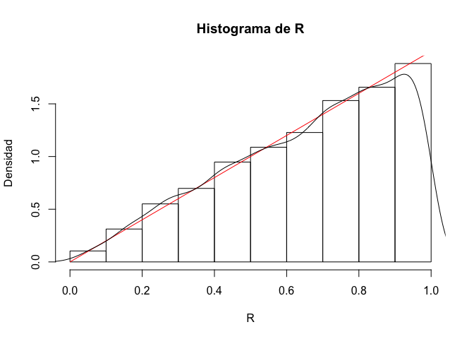
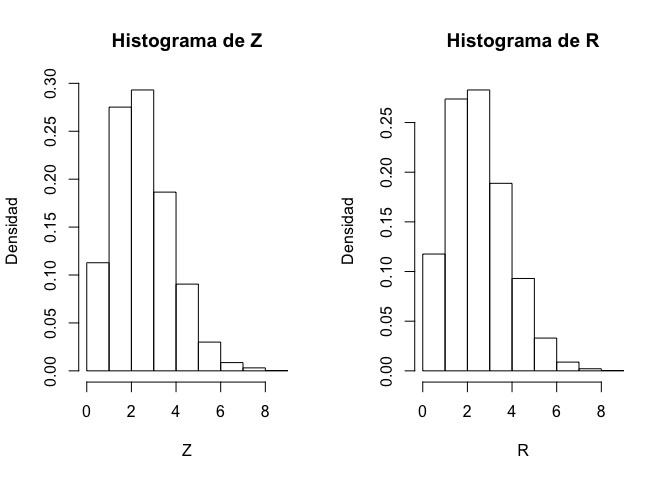
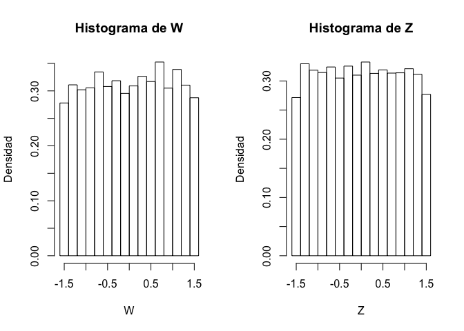
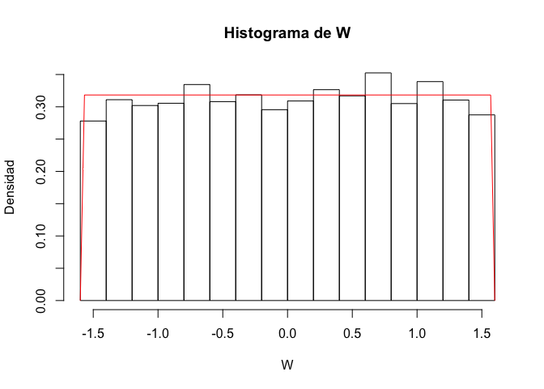

# Teoría de probabilidad
Martín Andrés Macías Quintero  

# _Ejercicios_

## Ejercicio 12.7 

Sean $(X, Y)$ _uniformes sobre la bola unitaria_, es decir,

$$
f_{(X, Y)} (x,y) =
\begin{cases}
\frac{1}{\pi}\text{ si } x^2+y^2\leq 1\\
\\
0 \text{ si } x^2+y^2 > 1
\end{cases}
$$

Encuentre la distribución de $R=\sqrt{X^2+Y^2}$. (_Pista_: Introduzca una variable aleatoria auxiliar definida como $S=Arctan\left(\frac{Y}{X}\right)$.) [Respuesta: $f_R(r)=2r\mathbb{1}_{0,1}(r)$.]

### *Demostración:*

Se introduce la variable aleatoria auxiliar $S=tan^{-1} \left(\frac{Y}{X}\right)$. Sea $g(x,y)=\left( \sqrt{x^2+y^2}, \tan^{-1} \left(\frac{y}{x}\right) \right)$. Si se escribe $r=\sqrt{x^2+y^2}$; $0\leq r\leq 1$ y $\tan^{-1} \left(\frac{y}{x}\right)$, las inversas serían $g_1^{-1}(r,\theta)=(r\cos\theta, r\sin\theta)$ y $g_2^{-1}=(-r\cos\theta, -r\sin\theta)$ puesto que $g$ no es inyectiva. Sus correspondientes jacobianos serían:


\begin{equation}
\left| J_{g_1^{-1}}  \right|
=\left| \det 
\begin{bmatrix} 
\cos\theta &  \sin\theta \\
-r\sin\theta &  r\cos\theta \\
\end{bmatrix}  \right|
=|r|=r
\end{equation}

\begin{equation}
\left| J_{g_2^{-1}}  \right|
=\left| \det 
\begin{bmatrix} 
-\cos\theta &  -\sin\theta \\
r\sin\theta &  -r\cos\theta \\
\end{bmatrix}  \right|
=|r|=r
\end{equation}

De esta forma, se tiene que:

\begin{equation}
\begin{split}
f_{Z,W}(z,w)&=r\{ f_{X,Y}(r\cos\theta,r\sin\theta) + f_{X,Y}(-r\cos\theta,-r\sin\theta)  \}
\mathbb{1}_{(0,1)}(r)\mathbb{1}_{\left(\frac{-\pi}{2},\frac{\pi}{2}\right)}(\theta)\\
&=r\mathbb{1}_{(0,1)}(r)\left(\frac{1}{\pi}+\frac{1}{\pi}\right)\mathbb{1}_{\left(\frac{-\pi}{2},\frac{\pi}{2}\right)}(\theta)\\
&=\frac{2r\mathbb{1}_{(0,1)}(r)\mathbb{1}_{\left(\frac{-\pi}{2},\frac{\pi}{2}\right)}(\theta)}{\pi}
\end{split}
\end{equation}

La densidad marginal sería:
\begin{equation}
f_R(r)=\int_{-\frac{\pi}{2}}^{\frac{\pi}{2}}\frac{2r\mathbb{1}_{(0,1)}(r)}{\pi}d\theta=2r\mathbb{1}_{(0,1)}(r)
\end{equation}

### *Simulación:*

Sean $X$ y $Y$ dos variables aleatorias con distribución $U(0,1)$


```r
set.seed(12345)
X<-runif(1000)
Y<-runif(1000)

R<-sqrt(X^2+Y^2)
R<-R[R<=1]

hist(R,freq = F)
curve(2*x,from = 0,to = 1,col=2,add=T)
```

<!-- -->

Gracias a la simulación, es posible que los datos de $R$ simulados a partir de dos variables uniformes, se ajustan a la distribución teórica.


## Ejercicio 12.11

Sean $(X, Y)$ normales independientes, ambas con media $\mu=0$ y varianza $\sigma^2$. Sea

$$
Z = \sqrt{X^2 + Y^2} \quad \text{y}\quad W=Arctan\left(\frac{Y}{X}\right), \quad\quad\quad-\frac{\pi}{2}<W\leq\frac{\pi}{2}.
$$
Demuestre que $Z$ tiene distribución Rayleigh, que $W$ es uniforme sobre $\left(-\frac{\pi}{2},\frac{\pi}{2} \right)$ y que $Z$ y $W$ son independientes.

### *Demostración:*
Sea $g(x,y)=\left(\sqrt{x^2+y^2}\right), \arctan\left(\frac{x}{y}\right)$

En este caso las inversas serían $g_1^{-1}(z,w)=(z\sin w,z\cos w)$ y $g_2^{-1}(z,w)=(z\sin w,-z\cos w)$ puesto que g no es inyectiva. Sus correspondientes jacobianos serían:

\begin{equation}
\left| J_{g_1^{-1}}  \right|
=\left| \det 
\begin{bmatrix} 
\sin w &  z\cos w \\
\cos w &  -z\sin w \\
\end{bmatrix}  \right|
=|z|=z
\end{equation}

\begin{equation}
\left| J_{g_2^{-1}}  \right|
=\left| \det 
\begin{bmatrix} 
\sin w &  z\cos w \\
-\cos w &  z\sin w \\
\end{bmatrix}  \right|
=|z|=z
\end{equation}

De esta forma, se tiene que:

\begin{equation}
\begin{split}
f_{Z,W}(z,w) \quad &= \quad \left( \frac{1}{2\pi\sigma^2}e^{\frac{-z^2}{2\sigma}}z + \frac{1}{2\pi\sigma^2}e^{\frac{-z^2}{2\sigma}}z \right) \mathbb{1}_{\left(-\frac{\pi}{2},\frac{\pi}{2}\right)}(w) \mathbb{1}_{(0,\infty)}(z)\\

&=\quad \frac{1}{\pi}\mathbb{1}_{\left(-\frac{\pi}{2},\frac{\pi}{2}\right)}(w)
\cdot\frac{z}{\sigma^2}e^{\frac{-z^2}{2\sigma}} \mathbb{1}_{(0,\infty)}(z)
\renewcommand{\qedsymbol}{\rule{0.7em}{0.7em}}
\end{split}
\end{equation}

### *Simulación:*

Sean $X$ y $Y$ dos variables aleatorias independientes con distribución normal con media $\mu$0 y varianza $\sigma^2=4$


```r
library(VGAM)

set.seed(12345)

X<-rnorm(1000,0,2)
Y<-rnorm(1000,0,2)
Z<-sqrt(X^2+Y^2)
```


A continuación se simulan datos de una distribución Rayleigh con $\sigma=2$:


```r
V<-rrayleigh(1000,2)
```

Al comparar los dos histogramas de los datos simulados a partir de $X$ y $Y$ con los de $Z$:


```r
par(mfrow=c(1,2))
hist(Z,freq = F,breaks = 10)
hist(V,freq = F,breaks = 10)
```

<!-- -->

Puede verse que los dos histogramas son similares, es decir, que tanto los datos simulados ($Z$) a partir de dos normales como los obtenidos ($V$) son equivalentes. Si se comparan con la función de densidad teórica:


```r
rayleigh<-function(x,y){
  (x/y^2)*exp((-x^2)/(2*y^2))
}

par(mfrow=c(1,1))
hist(Z,freq = F,breaks = 10,ylim = c(0,0.35))
curve(rayleigh(x,2),from = 0,to = 8,add = T,col=2)
```

<!-- -->


De esta forma, es posible confirmar que los datos de la distribución Rayleigh simulados a partir de dos normales coninciden con la función de densidad de una distribución Rayleigh.

Ahora, sean $X$ y $Y$ dos variables normales independientes con media $\mu=0$ y varianza $\sigma^2=4$


```r
set.seed(12345)

X<-rnorm(1000,0,2)
Y<-rnorm(1000,0,2)

U<-X/Y
W<-atan(U)
```


Al simular datos $Z$ de una distribución uniforme $U(-\pi/2,\pi/2)$, se tiene:.


```r
Z<-runif(1000,-pi/2,pi/2)
```

Al comparar los dos histogramas de los datos simulados a partir $X$ y $Y$ y los de $Z$:


```r
par(mfrow=c(1,2))
hist(W,freq = FALSE)
hist(Z,freq = FALSE)
```

<!-- -->

Se observa que los dos histogramas son similares, es decir, que tanto los simulados $W$ a partir de dos normales y los obtenidos $(Z)$ son equivalentes. Al comparar con la función de densidad teórica:


```r
unifor<-function(x,y,z){
  if(x>=y&x<=z){1/(z-y)}
  else{0}
}

unif<-Vectorize(unifor)

par(mfrow=c(1,1))
hist(W,freq = FALSE)
curve(unif(x,-pi/2,pi/2),add = T,col=2)
```

<!-- -->

Se confirma que los datos de la distribución uniforme entre $-\pi/2$ y $\pi/2$ simulados a partir de dos normales coninciden con la función de densidad de la una distribución uniforme.

## Ejercicio 12.15 

(_Simulación de variables aleatorias normales_) Sean $U_1$, $U_2$ dos variables aleatorias uniformes independientes sobre $(0,1)$. Sean $\theta=2\pi U_1$ y $S=-\ln(U_2)$.

a. Demuestre que $S$ tiene distribución exponencial, y que $R =\sqrt{2S}$ tiene distribución Rayleigh.

### *Demostración:*

\begin{equation}
S=-\ln(V)\\
S=h(v)=-\ln(V)\Rightarrow v=e^{-s} \Rightarrow v=h^{-1}(s)=e^{-s}\\
\left| \frac{dh^{-1}(s)}{ds}  \right|=\left| -e^{-s}  \right|=e^{-s}
\end{equation}

Como
\begin{equation}
f_V(v)=1 \quad f_S(s)=f_V(v)\cdot \left| \frac{dv}{ds}  \right|=1\cdot e^{-s}=e^{-s}
\end{equation}

De tal suerte que puede concluirse que $S \sim Exp(1)$

Ahora,

\begin{equation}
R=\sqrt{2S}=\sqrt{-2\ln(V)}\\
R=h(v)=\sqrt{-2\ln(V)}
\end{equation}

Luego,

\begin{equation}
R = \sqrt{-2\ln(V)}\\
R^2 = -2\ln(V)\\
-\frac{R^2}{2}=\ln(V)\\
V=e^{-\frac{R^2}{2}}
\end{equation}


b. Sean $X=R \cos\theta$, $Y=R\sin\theta$. Demuestre que $X$ y $Y$ son normales independientes.

(_Pista:_ Para la parte _(a)_ recuerde que una exponencial es un caso especial de una distribución Gamma: de hecho, esto es $\chi_2^2$. Para la parte (b) invierta el procedimiento del esjericio 12.11).

_Observación:_ El ejercicio 12.15 es conocido como el método Box-Muller para simular variables aleatorias normales.
